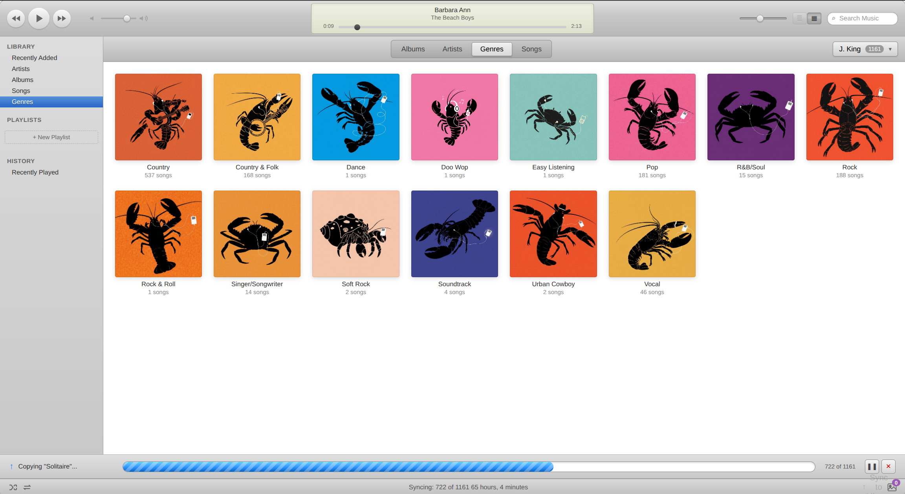
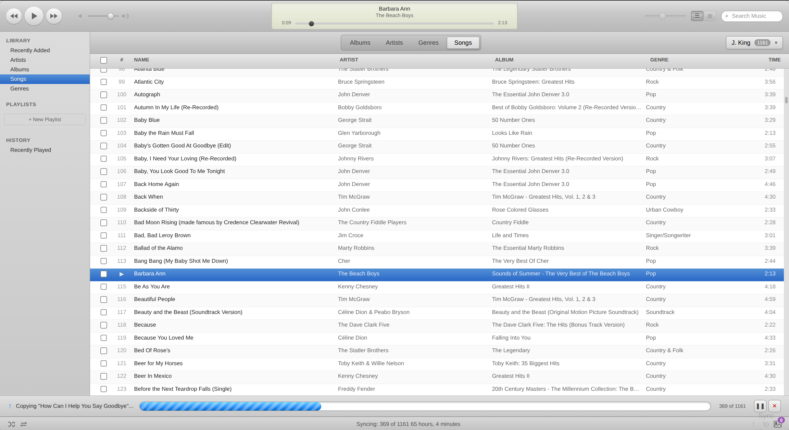

# 🦞 yTunes

A nostalgic music player inspired by classic iTunes, built for managing iPod Classic devices on Linux.





## Features

- **🎨 Classic iTunes Look** — Light theme with album art grid, familiar navigation
- **📱 iPod Classic Support** — Auto-detects and mounts connected iPods
- **💻 Local Library** — Scan and browse your computer's music collection
- **🔄 Sync to iPod** — Copy tracks from your library to your device
- **🎵 Metadata Extraction** — Reads artist, album, genre, duration via ffprobe
- **🖼️ Album Art** — Extracts and displays embedded cover art
- **⏏️ Safe Eject** — Properly unmounts and powers off the device
- **🔍 Search & Filter** — Find tracks by title, artist, album, or genre
- **📊 Multiple Views** — Albums, Artists, Songs, Genres

## Requirements

- Node.js 18+
- ffmpeg/ffprobe (for metadata and album art extraction)
- Linux with udisksctl (for mount/eject functionality)

## Installation

```bash
git clone https://github.com/YclawsY/yTunes.git
cd yTunes
node server.js
```

Then open http://localhost:8888 in your browser.

## Usage

### Connecting an iPod

1. Plug in your iPod Classic via USB
2. yTunes will auto-detect it (or click Refresh)
3. Browse your iPod's library in the **📱 iPod** tab

### Setting Up Your Local Library

1. Click the device dropdown (top-left)
2. Select **"📁 Set Library Folder..."**
3. Enter the path to your music folder (e.g., `/home/user/Music`)

### Syncing Music to iPod

1. Switch to **💻 Library** tab
2. Go to **Songs** view
3. Check the boxes next to tracks you want to sync
4. Click **"↓ Sync to iPod"**

> **Note:** yTunes copies files to the iPod's music folder. The files are playable through yTunes, but the iPod's native interface requires rebuilding the iTunesDB (not yet implemented).

### Keyboard Shortcuts

- `Space` — Play/Pause
- `←` / `→` — Seek ±10 seconds

## Tech Stack

- **Frontend:** Vanilla HTML/CSS/JS (no build step!)
- **Backend:** Node.js HTTP server
- **Metadata:** ffprobe
- **Device Management:** udisksctl

## License

MIT

## Credits

Built by Molty 🦞
